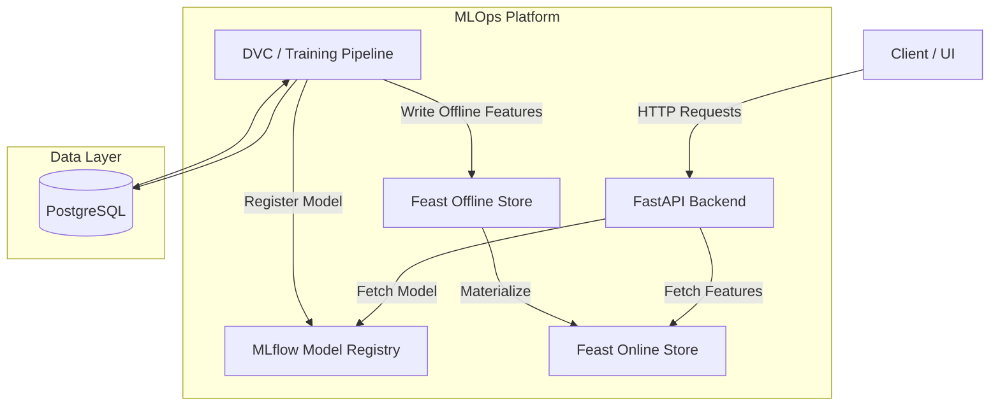

# System Architecture

This document describes the high-level architecture of the **Fraud Detection ML System**.

## High-Level Diagram

## Components

### 1. FastAPI (Serving Layer)
The entry point for real-time predictions. It receives JSON payloads, requests the latest feature vectors from the Feature Store, loads the production model from MLflow, and returns the fraud probability.

### 2. Feast (Feature Store)
Manages our offline (training) and online (serving) features. Ensures that the features used during training are identical to those used during inference, preventing train-serve skew.

### 3. MLflow (Model Registry)
The central source of truth for all models. The API pulls the model explicitly tagged as `Production` in the MLflow registry.

### 4. DVC (Data Version Control)
The pipeline orchestrator. Handles the DAG (Directed Acyclic Graph) of data ingestion, validation, feature extraction, and model training. Tracks the hashes of large files stored in an external remote (like S3 or local directory).

### 5. PostgreSQL
The relational database used to store raw transactional/filing data, metadata, and logging information from the API.
